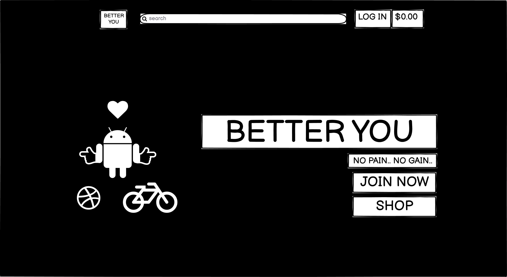
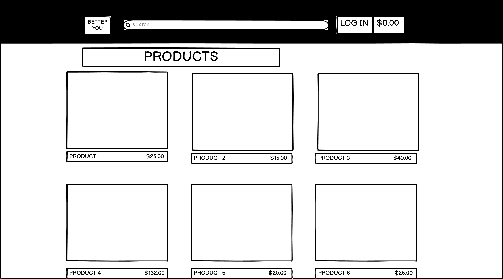
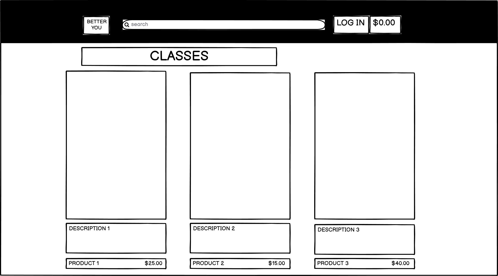

# BETTER YOU


Welcome to my Full Stack Frameworks with Django Milestone Project.

As a Fitness enthusiast and regular "gym-goer", being able to create my own fitness website, with the potential of becoming a real website that I could adapt on and develop in the future into a real training and e-commerce website was a no-brainer!

I chose to have a small products page where users could purchase the most necessary of items. From a beginners weights kit, with increasing weight sizes for the more experienced, as well as a small selection of clothing items for both men & women.


## Table Of Contents

1. [**UX**](#ux)
    - [**Project Goals**](#project-goals)
    - [**User goals**](#user-goals)
    - [**Developer Goals**](#developer-goals)
    - [**User Stories**](#user-stories)
    - [**Design choices**](#design-choices)
    - [**Wireframes**](#wireframes)

2. [**Features**](#Features)
    - [**Main Features**](#main-features)
    - [**Technologies Used**](#technologies-used)
    - [**Testing**](#testing)

3. [**Deployments**](#deployments)

4. [**Credits**](#credits)

5. [**Content**](#content)

6. [**Media**](#media)

7. [**Acknowledgements**](#acknowledgements)

# UX

## Project Goals

The Primary goal of BetterYou was as an e-commerce site, to sell products relating to the brand. (Although, as this is not a real website OR brand, I do not have any real products that are branded as Better You). Users would come to the site as a fan of Better You and want to buy the merchendise. If they wanted to become a "Better Them" they could also therefore look at the classes available to join.

#### User Goals

* A place to buy products under the Better You brand.
* A place where users can enquire about classes to become a Better Them.
* A simple, intuative, e-commerce process, where buying, selecting, adding to bag & checking out and recieving their order are easy.
* To be able to log in and out to decide if I want to be a recognised customer.
* To have a profile where I can save my information for future checkouts.
* A place to view my previous orders.

#### Developer Goals

* To be able to sell my products!
* To be able to help other become Better individuals (improve their fitness).
* To create a library of users & orders.
* To be able to easily create, update, view and delete my products and classes available.

## User Stories

#### As a User, I want:

1. I want to be able to visit this site and to be able to easily navigate to the products page or classes page, depending on what I am after.
2. I want to be able to easily navigate around the site on my computer and my phone.
3. I want to be able to add products to my bag, continue shopping if I wish, or checkout if I am finished.
4. I want to be notified of my basket when I add new products to it, so I can be reminded of what I have placed in it, as well as the total amount.
5. I want to be able to save my billing information, so I do not need to add it everytime I checkout.

#### As a Developer, I want:

1. A user-friendly e-commerce site where users will want to come back to purchase more products or sign up to my classes.
2. I want an easy way to add more products / classes as my library increases in size.
3. I want to be able to view my users that have signed up to the website as well as what they have purchased.
4. I want a place to store my library of images and static files.

## Design Choices

* The design choice for this website was taken from Boutique Ado. I am a fan of black & white monochromatic design styles, so this was perfect for me.

* I however wanted to try a transparent background with no header or nav bar visible at the top of the page. I was able to create this to show a full page background image with a 50% tranparent nav-bar so the text was still visible.

#### Fonts

* I found a strong uppercase font that I liked and used it throughout the site, capitalising everything where possible.

#### Icons

* Icons were taken from Font Awesome. Used for drop-downs, form & buttons.

#### Colours 

* No colours were technically used apart from to customise toasts, alerts and messages. The rest of the site was black & white.

#### Styling

* Full page background - with transparent nav-bar elements.
* Black nav-bar when not on main page, with white overlays.

#### Background, Images & Audio

* Two background images were used. One for Desktop and one for mobile. This was users would get the feel of a more expansive website depending on whether they were viewing on Desktop or Mobile.
* Other images were used for products or class images. I tried to chose the most object focused images as possible with as little of the model, but found it hard to find clothing images without a person wearing them.

## Wireframes

My wireframes were created using [Balsamiq](https://balsamiq.com/).




Full page background with essentially floating nav items and a dropdown left menu for mobile view. Large buttons on the home page to draw the users to click on Shop Now or Join Here.



Simple large images of products. Name of product, price, rating below.



Same layout as products except always one item on a row. Simple large images of classes. Name of class with price. On the class_details page there would be a description of what the class involved and a place for users to email to enquire.


Simple layout of the items in the users bag, and sizes applicable, price of each product as well as the total amount. Users saved information from their profile or blank fields for the user to input to. An option for users to save these details and to register to become a user.

# Features 

## Main Features

* HOME PAGE - The landing page. Would feature a single large image taking up 100% of the height and width of the page. Further down the page would be a large button for users to visit the shop.

* Nav bar - There would be the search bar, nav items, login logout & account options and the total bag value. There would be a slightly different view for admins to be able to view product management to add/delete edit products or classes.

* Products page - This page would hold the products of the site. It would have 2-4 products per row depending on the size of the screen, with 1 per row for mobile. Each of the products would have the name, rating and price of the product.

* Classes page - Similar to the products page, this page would have 1 class per row, vertically styled with a heading on each page. Clicking on each class would take users to the class_details page where there would a detailed description of each class, the price as well as how to sign up.

* Login, Logout, Register pages - Simple form for users to either add their existing username and password or for users to sign up with username, email and password.

* Bag page - A place where users can view their bag and the items they have gathered there. The bag would show each item, with image, sizes, price as well as the quantity of each item added. They would be able to update the bag by either increasing, decreasing or deleting the item.

* Checkout page - Checkout page like the wireframe above would be similar to the bag where it would show users the items in their bag. They would not be able to adjust the bag, as they would need to do this in the bag page, but they would be able to see the details of each item, quantity, individual price as well as total bag amount. They would also have a form to input their billing details as a new user and card details. If they were a registered user then hopefully they will have pre-filled information.

* Checkout success page - This would confirm to the user that the order has been sent through. It would have another copy of the users bag, with an order confirmation number as well as a message that this order had been sent to their attached email. There will also be a button to guide users to continue browsing the site.

* Product Management - Add /Delete /Edit products. This is where an admin would be able to view the details of each product and be able to update it for price changes, sales or to add new products.


# Technologies Used

* HTML 
* CSS
* JS
* PYTHON / DJANGO
* AMAZON AWS - to store my static & media files 
* HEROKU - to deploy my final website to.
* [BOOTSTRAP](https://getbootstrap.com/)
    - 
* [Font Awesome](https://fontawesome.com/)
    - FA used to implement all the icons for improving UX and the website design.
* [Code Institute](https://codeinstitute.net/)
    - Many of the code techniques and lines of code from previous projects created were re-used in this project. Such as how to create functions, for & if loops, linking each page together with url_for()'s and setting up the base plate of the website with importing the correct frameworks. 

# Testing

## Testing the stories from UX section

### As a User, I want:

1. I want to be able to visit this site and to be able to easily navigate to the products page or classes page, depending on what I am after.

* Simple layout. Large buttons to the next / previous pages.

2. I want to be able to easily navigate around the site on my computer and my phone.

* Mobile friendly view that either simplifies the organisation of the page or shrinks the fonts/images to accomodate.

3. I want to be able to add products to my bag, continue shopping if I wish, or checkout if I am finished.

* Under each product there is an add to bag button or a back to shopping button. When users add an item to the bag it will keep them on this page where they can then continue shopping.

4. I want to be notified of my basket when I add new products to it, so I can be reminded of what I have placed in it, as well as the total amount.

* A toast will pop up in the top right to inform users that a product has been added to their bag. They can then either dismiss it, or click to view their bag.

5. I want to be able to save my billing information, so I do not need to add it everytime I checkout.

* When users checkout they can tick a box to save their billing information. This will prompt them to a register page if they are not already registered just update their current details.


#### As a Developer, I want:

1. A user-friendly e-commerce site where users will want to come back to purchase more products or sign up to my classes.

* Simple layout. Large buttons to the next / previous pages. Mobile friendly view that either simplifies the organisation of the page or shrinks the fonts/images to accomodate. Quality products.

2. I want an easy way to add more products / classes as my library increases in size.

* Each product in the admin view will have an edit / delete button where products can be updated. Admins can also navigate to product management where they can add new products.

3. I want to be able to view my users that have signed up to the website as well as what they have purchased.

* In /admin, the admin can view the user profiles as well as their previous orders.

4. I want a place to store my library of images and static files.

* AWS stores all of the images and static files. When a new upadte is pushed it will save the static files then any images need to be uploaded their to be stored.


### ON THE GO TESTING / PROBLEMS

1. General
* Following along with the Boutique_Ado project I found few problems apart from typos and mis-indented code. These were generally simple fixes and just required be to carefully scan over my code or to go back in a video to see what I may have added incorrectly.

2. Nav Bar
* I like nav-bars and I like playing around with them, customising them. This time I decided to have only text for larger screens and only icons for smaller screens. This took some figuring out how to hide the text on small screens and replace with the icon for smaller, but I managed to have it so when the screen size got small enough they would swap and the hideen icon would appear and the text would hide.

3. CONTAINERS
* I had an issue where my content was sticking to the top of the page and being initally hidden behind my nav-bar. To fix this I added a 164px container (96px on mobile) above all my content on each page to push down my content to below the nav-bar.

4. HTML/CSS
* I like straight sharp shapes. I chose to remove as many curves as possible and to have all my boxes rounded-0 and my fonts capitalised. This was simple enough to apply througout the entire site once I had found the style I liked. I chose to apply a thin border around my elements with a small amount of padding and kept them in line with my black and white theme.

5. TRANSPARENCY 
* The largest recurring problem I had during this project was having a transparent background on one page and a solid one on the other. I wanted to have a transparent nav-bar on each page, but it was not possible due to the scrolling required from the product and classes pages. This meant I have to have my nav bar be black on product pages but transparent on the main page. I was able to do this by adding a black container that would sit at the top of each page above the content but below the nav bar itself. I made sure it was the same height as the nav-bar, smaller on the mobile screens and 100% width. 
* The next problem came when expanding the nav bar, as the black background was a fixed height. I overcame this problem by applying a black background to the dropdown nav elements only in mobile view (where the nav drop down was visible) and on their seperate css pages for each page, so as not to apply it the home page.

6. PRODUCTS
* As I do not already own an e-commerce store I did not have access to a large library of products and had to find appropriate images online. This meant that they were all sorts of sizes and shapes. I managed to oranise them as best as possible to have two portrait images next to each other and any landscape images next to each other to allow for a more uniformed products page. 

7. MEDIA QUERIES
* The hardest media query for me to satisfy was the smallest phone. Making sure the nav-bar fit in. To do I have to reduce the margins and padding on the nav-bar elements, reduce the icon font sizes and for one element, change it from text to icon as the word was quite long. I also had to adjust the dropdown menu to be more to the left as it was cutting off the page. To do this I adjusted its position(x,y,z)when it dropped down to be move over to the center of the page.

8. BILLING INFORMATION
* I wanted the billing information to save the users name as well so I added the name field to the billing form and had it saved to the users profile. To do this I also had to add a space in the users profile for full_name and linked up the two using crispy_forms.


9. checkout_wh/
* As my first time Stripe, I struggled to use the webhooks functionality... Especially as the boutique guide was outdated and the stripe admin page had changed since. They had decided to remove the webhook testing button, meaning the only way to test was to submit a checkout order. Simple enough, just more time consuming. The main problem came when I came back a day later to try again and my webhooks were now failing. I had changed no code and they were fine when I left. After a discussion with some fellow students on slack, it became apparent that when you reload the gitpod repo it changes its web address meaning it breaks the webhooks and a new secret key must be assigned each time you re-load gitpod. Once I realised the problem it was fine, time consuming to add a new code each day but fine. It of course fixed itself upon deploying to Heroku and has not failed since.

10. The mysterious deps.txt
* Upon deploying the Heroku, I was having perculiar trouble with a couple of requiremnts not working together and causing errors upon deployment. A tutor from CI said that he did not recognise the requiremnts as those that should be in my project. I was advised to delete the culprits, commit and try to deploy again. This worked, but the tutor found a good 8 or so items in the requirements.txt file that should not have been there. Later on, my github told me that these files were causing security issues with my project. I took the advice from dependenciesbot and upated some of them to more secure versions. Stil unsure how these files got into my project as they were added with my "initial commit".

11. django_countries
* Just my luck. I followed the guide and added django_countries to my requirements.txt and commited the changes, only to come across and error that I did not know how to fix. Neither did the tutor I was assigned. It turned out that django_countries had just put out an update only 18hrs ago, which of course had a bug that was conflicting with django. The tutor informed me of the best previous version of django_countries to go back to and it worked fine from there!


### POST-CONTRUCTION TESTING

* The lighthouse testing was mostly 100% aside from some controversial color issues that were ignored and adding a meta description.

* I thought that there was a major problem with my images not being loaded by AWS to Heroku, but my CSS was. Turns out I just did not upload my home page background image to AWS. Simple Fix.

* I struggled for a short while as to why my recently created classes model was not appearing on the deployed Heroku page but they HTML was. I was getting a 500 error. I turned on development mode to take a look. A kind tutor informed me that I needed to migrate the models to Heroku as well as my local repository.

* I had created my Fitness Classes in the Admin on my local repo, but was informed by the tutor that without fixtures they would not be visible on my Heroku app. So I had to manually add them again to the admin panel on Heroku. I also uploaded their images to AWS.

* Just before commiting my final deployment I tried to fix some PEP8 issues with lines being too long. In trying to fix this issue, I accidentally cut on of my links in half causing a templating error to occur, blocking access to my add_products page. I retraced my steps and found the cut code and re-stitched it together.


# Deployments

## Heroku

This project was deployed to Heroku through the following steps:

1. Create a "requirements.txt" file using the terminal command "pip freeze > requirements.txt".

2. Create a "Profile" with the terminal command "echo web: pythong app.py > Procfile".

3. git "add" and "git commit" the requiremnts.txt and Procfile, then "git push" to GitHub.

4. Create a new app on the [Heroku](https://www.heroku.com/) website by clicking "New" button in your dashboard. Give it a name and set the region to Europe.

5. From the Heroku dashboard of the new app, click on "Deploy" > "Deployment method" and select Github.

6. Confirm the linking of the Heroku app to the correct GitHub repository.

7. In the Heroku dashboard for the application, click on "Settings" > "Reveal Config Vars".

8. Remove DEVELOPMENT = True and DISABLE_COLLECTSTATIC = 1.

9. In the Heroku dashboard, click "Deploy".

10. In the "Manual Deployment" section of this page, make sure the main branch is selected and then click "Deploy Branch".

11. The site is now successfully deployed.


## Forking the GitHub Repository

Forking is the action of creating a copy of the original file on your own GitHub account to view and/or edit without making changes to the original repository. To do this:

1. Log in to GitHub and find the GitHub Repository you wish to use.
2. At the top of the Repository, below the Repository title, find the "Fork" button in the menu.
3. A new copy of your own should now be located in your own GitHub account.

## Making a Local Clone

1. Log in to GitHub and find the GitHub Repository you wish to use.
2. At the top of the Repository, above the most recent commit, click "Code" then choose your option for Cloning.
3. To clone using HTTPS, copy the link under "Clone with HTTPS".
4. Now open Git Bash.
5. Choose the location you wish to save the cloned directory.
6. Type `git clone`, then paste the URL copied in Step 3.

```
    $ git clone https://github.com/Otterrr/fitness_project_ms4.git
```

7. Press Enter. Your local clone will be created.

```
$ git clone https://github.com/Otterrr/fitness_project_ms4.git
> Cloning into 'fitness_project_ms4'...
> remote: Enumerating objects: 330, done.
> remote: Counting objects: 100% (330/330), done.
> remote: Compressing objects: 100% (189/189), done.
> remote: Total 330 (delta 182), reused 247 (delta 103), pack-reused 0
> Receiving objects: 100% (330/330), 8.67 MiB | 11.68 MiB/s, done.
> Resolving deltas: 100% (182/182), done.
```
 
# Credits

* [Code Institute](https://learn.codeinstitute.net/courses) - specifically The Boutique Ado ecommerce project.
* [BOOTSTRAP](https://getbootstrap.com/)

Various functions and code snippets were adapted upon from the mini-project as well as bootstrap. All code where appropriate was typed by hand and functions and variables were renamed for my own project.

# Content

* I used google font Maven+Pro for my entire site. I used a capitalised version as I like the strong look it gave.

# Media

* Product images were sourced from [Pexels](https://www.pexels.com/) & [Unsplash](https://unsplash.com/).

        1.PEXELS.COM - 
        Scott Webb - Woman Pushing Barbel Using Her Feet 
            Woman Hanging on Gym Equipment on Focus Photo
        Pixabay - Green, Blue, and Pink Kettle Bells on Blue Surface
            Woman Holding Exercise Equipment
        Karolina Grabowska - All cast dumbbell placed on marble table
            Set of fitness equipment placed on marble surface
        Victor Freitas - Several Rogue Gym Plates
        Eduardo Cano Photo - Black Barbell on the Ground
        Dom J - Black Skip Rope
        Keiji Yoshiki - Man in Black Tank Top Holding Brown Stretching Rope
        Cesar Galeao - Man Holding Dumbbell
        Andres Ayrton - Asian man working out with gym equipment

        UNSPLASH - 
        Tyler Nix
        Jonathan Borba
        Total Shape
        Alonso Reyes

* Icons were sourced from [Font Awesome](https://fontawesome.com)

# Acknowledgements

* [Github Pages](https://pages.github.com/)
* [Font Awesome](https://fontawesome.com)
* [Code Institute](https://learn.codeinstitute.net/courses)
* [BOOTSTRAP](https://getbootstrap.com/)
* [Slack](https://slack.com/intl/en-gb/)
* [W3Schools](https://www.w3schools.com/)
* [Stack Overflow](https://stackoverflow.com/).
* [Wikipedia](https://en.wikipedia.org/wiki/Main_Page) - used for some product & classes descriptions.
